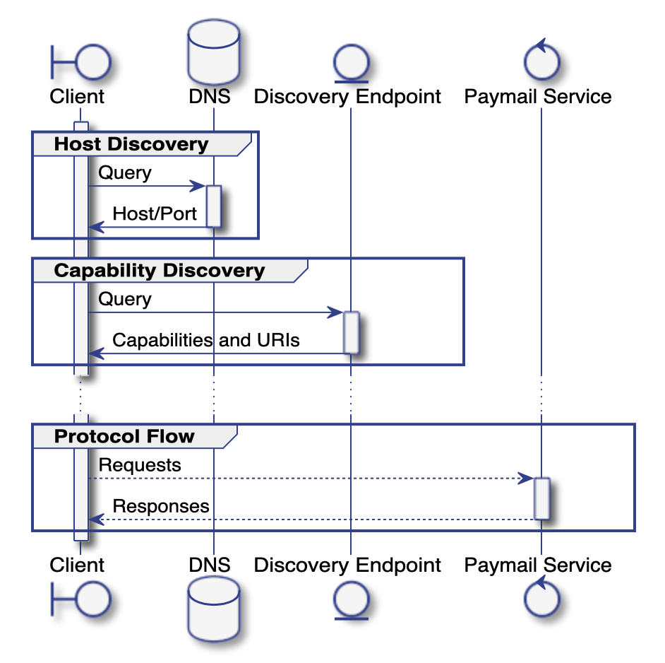

SBW 1: Paymail
==============

Authors
-------
* Andy &lt;[unknown]@nchain.com&gt;
* Ryan X. Charles &lt;ryan@heartmail.com&gt;

Dependencies
------------

* WWW

Introduction
------------

The basic idea of paymail is that we extend email addresses like
user@example.com to also have an HTTPS URL hosted at example.com or a third
party for extensible API calls including both a public key for use in
cryptography as well as sending data such as Bitcoin transactions or messages or
files. It can be thought of as "email 2.0" or "email with cryptography" or
"email but with Bitcoin" or "email for Bitcoin".

Paymail uses DNS records to find the paymail host and then a .well-known file to
list the supported services.

This elementary specification outlines the basic idea of paymail which rests on
the notion of service discovery, meaning finding the services supported by a
given paymail. The first extension, the addition of a public key, is found in
the next protocol specification, SBW 2.

Many SBW protocols are extensions to paymail. In this initial protocol, we
simply copy the original paymail protocol spec into the SBW, with some minor
backwards-compatible changes.

The "official" paymail spec can be found here:

https://www.bsvalias.org/

The changes we make are:

- Do not use BRFC. Instead, just label your paymail extensions as
"sbw-[number]-[name]" exactly like the filename of the spec in the repo. This
will never create a naming conflict because we are using the "sbw-" namespace.
This makes it easier to read the code and look up the relevant spec.

- Never support pay-to-address. This broken and unscaleable payment method
should never be support. We should only support peer-to-peer transactions. That
is to say, from Day 1 of the launch of SBW / OpenSPV, all transactions are sent
to the recipient and not simply broadcast to the miners.

## Service Discovery

Service discovery is separated into two phases:

* **Host Discovery** is a DNS based lookup of the responsible host for a given
  paymail alias.
* **Capability Discovery** resolves the paymail service endpoint URIs from the
  responsible DNS host and describes the capabilities supported by a given
  paymail service instance.

### Service Discovery Process



## Host Discovery

Host discovery is the process through which a domain owner optionally specifies which web host to interrogate during capability discovery. The host discovery process involves the creation and subsequent query of `SRV` DNS records.

The use of an `SRV` record was chosen for the following reasons:

* Domain owners may choose to use a third-party paymail service provider. Delegating authority to this provider is a one-time activity (the creation of a DNS `SRV` record).
* `TXT` records were considered, however should the paymail service be reconfigured (for example, the root URI change from `.../api/v1/...` to `.../api/v2/...`), the domain owner would have to coordinate with the service provider to ensure the `TXT` record (containing a full endpoint URI) was updated. With `SRV` records (plus the **Capability Discovery** protocol), the Host Discovery phase is _set-and-forget_.
* As an optional step, if the canonical Capability Discovery host is the same as the domain found in the paymail alias, the DNS record can be omitted entirely.
* DNS records (including `SRV`) feature a TTL, which clients can use for caching responses. All common DNS clients implement this caching _out-of-the-box_, meaning implementers do not have to roll this themselves.

### Setup

A domain owner may create an `SRV` record with the following parameters:

| Parameter | Value                       |
|-----------|-----------------------------|
| Service   | `_bsvalias`                 |
| Proto     | `_tcp`                      |
| Name      | `<domain>.<tld>.`           |
| TTL       | `3600` (see notes)          |
| Class     | `IN`                        |
| Priority  | `10`                        |
| Weight    | `10`                        |
| Port      | `443`                       |
| Target    | `<endpoint-discovery-host>` |

The `TTL` parameter should be set very low for test configurations (a few seconds), whereas for production deployments this should be set higher, to allow caching to work. A value of `3600` is suggested for production deployments.

Although the DNS system allows for multiple records with a variety of priorities and weights, which allows for some level of traffic management, resilience, and load-balancing via DNS records, it is recommended by this specification that these considerations be handled by more modern infrastructure and only a single `SRV` record be created.

See [https://en.wikipedia.org/wiki/SRV_record](https://en.wikipedia.org/wiki/SRV_record) for more information on `SRV` DNS records.

`SRV` records **must** be served with a valid [DNSSEC](https://en.wikipedia.org/wiki/Domain_Name_System_Security_Extensions) signature chain with the exception that if the `SRV` record points to `<domain>.<tld>` or `www.<domain>.<tld>`, then the `SRV` records **should** be served with a valid DNSSEC signature chain.

### Client Queries

Given a paymail alias `<alias>@<domain>.<tld>`, a paymail client would perform a DNS lookup for an `SRV` record matching `_bsvalias._tcp.<domain>.<tld>`. The combination of `Target` and `Port` fields are then used for Capability Discovery. Should no record be returned, a paymail client should assume a host of `<domain>.<tld>` and a port of `443`.

#### Security and SRV Records

In its legacy form, that is, without DNSSEC, DNS is not a secure mechanism. It is susceptible to a range of attacks, the most serious for the purposes of the BSV Alias protocol being an intercept or man-in-the-middle (MITM) attack. In this scenario an attacker intercepts DNS queries and responds with their own data. This would allow an attacker to direct a client to a paymail implementation of their choosing, which would further allow for them to control all further communications with a client.

Note: whilst an exception to the requirement for DNSSEC is made for cases where the `SRV` record points to the same target domain as the `SRV` record itself it is best practice to enable DNSSEC in all cases.

Clients **must**, therefore, resolve hosts with the following procedure.

1. Query for an `SRV` endpoint at `_bsvalias._tcp.<domain>.<tld>.`.
1. If an `SRV` record is found and the reponse target points to `<domain>.<tld>` or `www.<domain>.<tld>`, but the response is _not_ served with a valid DNSSEC signature chain, proceed to capability discovery using the target/port combination as specified by the `SRV` record and rely on the SSL certificate for the prevention of man in the middle attacks. Note that in this scenario it is possible to still receive malicious DNS information, however SSL certificates prevent further MITM attacks.
1. If an `SRV` record is found, but the response is _not_ served with a valid DNSSEC signature chain and the response target does NOT point to `<domain>.<tld>` or `www.<domain>.<tld>`, ignore the `SRV` record completely and continue with an `A` record query as in step 5, relying on the SSL certificate for the prevention of man in the middle attacks. Note that in this scenario it is possible to still receive malicious DNS information, however SSL certificates prevent further MITM attacks. The worst that may happen here is that, for a domain that has delegated BSV Alias services out to a service provider, further lookups fail and the client cannot proceed at this time. However the option of falling back to an `A` record and relying on SSL prevents a possible denial of service vector where a malicious actor has compromised DNS.
1. If an `SRV` record is found, and the response _is_ served with a valid DNSSEC signature chain, proceed to capability discovery using the target/port combination as specified by the `SRV` record.
1. If no `SRV` record is found, instead query for an `A` record for `<domain>.<tld>.` and proceed to capability discovery, verifying that the SSL certificate presented by the remote host is valid for `<domain>.<tld>.`.

A client **must** fail the request in the following cases:
* The SSL certificate for the target domain does not verify as valid for that target domain regardless of whether the target domain is discovered via the `SRV` record or via the `A` record.
* An `SRV` record is not served; AND `<domain>.<tld>` does not host a valid capability discovery service.
* The `SRV` response target does NOT point `<domain>.<tld>` or `www.<domain>.<tld>`; AND the `SRV` record is not served with a valid DNSSEC signature chain; AND `<domain>.<tld>` does not host a valid capability discovery service.

## Capability Discovery

Following on from **Host Discovery**, the next step a paymail client performs is Capability Discovery.

Capability Discovery is the process by which a paymail client learns the supported features of a paymail service and their respective endpoints and configurations.

Drawing inspiration from [RFC 5785](https://tools.ietf.org/html/rfc5785) and IANA's [Well-Known URIs](https://www.iana.org/assignments/well-known-uris/well-known-uris.xhtml) resource, the Capability Discovery protocol dictates that a machine-readable document is placed in a predictable location on a web server.

### Setup

A paymail service operator creates a JSON formatted text file at the following location:

`https://<host-discovery-target>:<host-discovery-port>/.well-known/bsvalias`.

* The file _MUST_ be served over HTTPS
* The value of the HTTP `Content-Type` header _MUST_ be set to `application/json` and optionally _MAY_ indicate a schema as an attribute, for example `application/json; schema="https://schemas.nchain.com/bsvalias/1.0/capability-discovery"`
* The successful response status code _MUST_ be either `200` (OK) if the `bsvalias` file exists, or `304` (Not Modified) if valid cache query headers are supplied within the request.
* The response _MAY_ indicate the document's validity via standard HTTP caching and expiry related headers. Operators are advised to consider configuring their web server to support the broadest range of supported client caching mechanisms, including `Cache-Control`, `Last-Modified`/`If-Modified-Since`, `Etag`, and `Expires`. Many standard clients and libraries implement standards-compliant caching behaviour. Further details are available from [MDN](https://developer.mozilla.org/en-US/docs/Web/HTTP/Caching)
* The `bsvalias` file must conform to the following format:
    ```json
    {
      "bsvalias": "1.0",
      "capabilities": {
        "pki": "https://bsvalias.example.org/{alias}@{domain.tld}/id",
        "[extension-name]": "[extension-url]"
      }
    }
    ```
* The template values `{alias}` and `{domain.tld}` refer to the components of paymail handle format `<alias>@<domain>.<tld>` and are literal; clients are expected to replace them wherever they appear in the endpoint URI with the actual values from the paymail handle
* Additional capabilities may extend this document. It is a matter for each specification author to describe the data structure required for their particular protocol, however the location of that data structure must be a key within the `capabilities` object. As an example, a (fictional) capability with ID `001122334455` requires a simple boolean flag in addition to an endpoint URI. It would extend the `.well-known/bsvalias` document like this:

  ```json
  {
    "bsvalias": "1.0",
    "capabilities": {
      "001122334455": {
        "endpoint": "https://bsvalias.example.org/{alias}@{domain.tld}/example",
        "flag": true
      }
    }
  }
  ```

### Client Queries

Having retrieved a `Target`:`Port` pair using Host Discovery, a paymail client constructs an HTTP GET request to `https://<target>:<port>/.well-known/bsvalias`, including caching hints from previous requests (if any).

Following a successful request, clients have now discovered all configuration information required for interacting with a paymail service and are aware of all supported extension protocols offered by the remote.

### Changes from previous versions

In the original drafts, the `bsvalias` file was a text based, tab-delimited list of `<domain>.<tld> \tab https://<base-uri>` pairs.

* This was removed to avoid data leakage about domains hosted by a given paymail service
* The format was changed from tab-delimited text to JSON
* Capability Discovery was merged into the previous Address Discovery base URI approach
* A paymail (`bsvalias`) version field was added for forward compatibility, although its interpretation is unspecified at this time

### Design Considerations

In a previous version of this specification, this step of the service discovery returned a base URI from which all request URIs would be built. It was suggested that the `.well-known/bsvalias` document merge a separate capability discovery which was originally planned to exist at `<base-uri>/capabilities`. In doing so, the following points were considered:

#### Capabilities differ by domain and by user within a domain

  * Service providers hosting multiple domains may offer different capabilities at different price points
  * Administrators may enable or disable capabilities on a per-user bases

A single `.well-known/bsvalias` document cannot describe the per-alias/per-domain capabilities. Instead it describes the services supported by the implementation, regardless of account-level availability. Where a paymail implementation supports a particular protocol but it is not enabled for a given account, upon receiving a request that will not be fulfilled, a `404` (Not Found) response should be given. This is (deliberately) indistinguishable from `{alias}`/`{domain.tld}` not found.

#### Simplified client/request flow

Merging capability discovery reduces the amount of requests made in order to locate a given service endpoint, and simplifies client implementations. 

#### More complicated deployment

One drawback of merging the two phases of discovery is that `.well-known/bsvalias` is no longer _set-and-forget_.

Prior to merging these to functions, a redeployment of the paymail service implementation may deliver new capabilities. These would be automatically discovered by clients.

Having merged service location and capability discovery into `.well-known/bsvalias`, this file must also be updated when a service deployment delivers enhanced capabilities. It is recommended that implementers of server software deliver an endpoint that can generate a valid `.well-known/bsvalias` response, and that operators configure a proxy to transparently service this implementation-provided endpoint when a request for the well known capabilities file is received.
