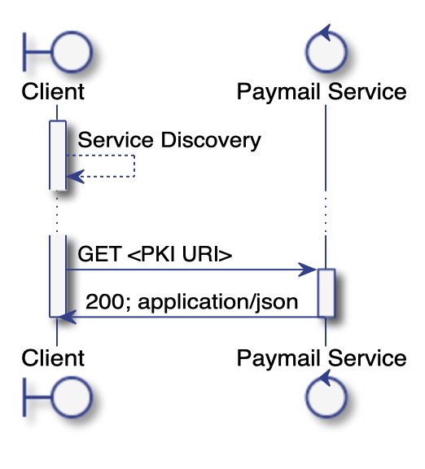

# SBW 2002: Paymail public key infrastructure (PKI)

## Authors

* Andy &lt;[unknown]@nchain.com&gt;
* Ryan X. Charles &lt;ryan@heartmail.com&gt;

## Dependencies

* SBW 2001: Paymail

## Introduction

A central aspect of paymail is the ability to link a public key for use in cryptographic algorithms to an email address. This enables extensions of email to secure communications.

This spec is copied from the original paymail "PKI" specification with no substantive modifications.

The original spec is located here:

https://www.bsvalias.org/03-public-key-infrastructure.html

## Public Key Infrastructure

Each paymail handle `<alias>@<domain>.<tld>` _MUST_ be issued a stable ECDSA public key that _SHOULD NOT_ be used as part of any on-chain transaction. Clients must be able to locate the public key from information within the `.well-known/bsvalias` configuration file:

```json
{
  "bsvalias": "1.0",
  "capabilities": {
    "pki": "https://bsvalias.example.org/{alias}@{domain.tld}/id",
  }
}
```

The template values `{alias}` and `{domain.tld}` refer to the components of target paymail handle `<alias>@<domain>.<tld>` and must be substituted by the client before issuing a request.

### PKI Flow



### Client Request

The `capabilities.pki` path returns a URI template. Clients should replace the `{alias}` and `{domain.tld}` template parameters and then make an HTTP GET request against this URI.

Standard HTTP caching headers _SHOULD_ be supported, and clients that have previously requested the public key _SHOULD NOT_ re-request information within any server-advertised caching window.

### Server Responses

Below are the responses that have meaning to this protocol. A server may return other status codes, for example `5xx` indicating some sort of server failure. Clients should treat status codes not specified as part of this specification as some sort of transient error and may retry at their leisure.

### 200 OK

Returned when a valid request for a known paymail handle has been received. The return message _MUST_ have a content type of `application/json`. The response body _MUST_ conform to the following schema:

```json
{
  "bsvalias": "1.0",
  "handle": "<alias>@<domain>.<tld>",
  "pubkey": "..."
}
```

The public key _MUST_ be a valid point on the secp256k1 curve, compressed, and hex-encoded. This means that the pubkey string length _MUST_ be 66 bytes long (33 bytes binary, each byte encoded as two hex characters):

| Start | Length | Value                                             |
|-------|--------|---------------------------------------------------|
| `00`  | `02`   | "Odd/even" indicator, must be either `02` or `03` |
| `02`  | `64`   | Elliptic curve point x-coordinate                 |

#### 304 Not Modified

No public key rotation has taken place since the previous request, based on caching headers supplied.

#### 404 Not Found

The paymail handle was not found by this service.
